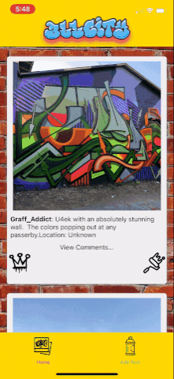

# allcity-ios
# Contributors:

 

**Steven Semco** - Full Stack Web Developer 
[GitHub](https://github.com/yetifunk) • [LinkedIn](https://www.linkedin.com/in/stevensemco/)

**Ross Phillips** - Full Stack Web Developer 
[GitHub](https://github.com/CrowdedAstronaut) • [LinkedIn](https://www.linkedin.com/in/johnrossphillips/)

**Adina Weinberg** - Full Stack Web Developer 
[GitHub](https://github.com/adinahanna) • [LinkedIn](https://www.linkedin.com/in/adinaweinberg/)

**Jesse Turek** - Full Stack Web Developer 
[GitHub](https://github.com/turekjesse) • [LinkedIn](https://www.linkedin.com/in/turekjesse/)

 

# Table of Contents

- [About this project](#about)
- [Workflow](#workflow)
- [Technologies](#technologies)
- [Links](#links)
- [Installation](#install)
- [APIs](#apis)

 

# About the Project 
AllCity is a fully rendered, interactive, full-stack mobile app/social media platform that allows users to learn more about graffiti art, the artists, the location, and the creation date. We prioritized semantic naming conventions, hierarchies and aria-labels to ensure AllCity works well with assistive technologies (ie screen readers).

## User Stories
As a user of All-City, I want to be able to view the top pieces of graffiti art, as well as their locations, their artists, and comments about the pieces.
As a user of All-City, I want to be able to read comments about graffiti art, and to be able to create my own comments about graffiti art.

## Home Page

- Click the app icon to launch the app
- Click the spray can icon to create a new post
- Click the king icon to like a post
- Click the roller icon to comment on a post
- Click the gallery icon to see a gallery view of all posts

 

# Workflow 

Our team used Agile workflow for this sprint.

## Trello

A Trello board was used to create and track tickets. We held daily meetings to discuss accomplishments, challenges, and upcoming tickets. To effectively collaborate remotely while allowing for quick communication if needed, we utilized Slack and Zoom.

## Version Control

We implemented Git Feature Branch Workflow. All pull requests in Github were reviewed by another team member before being merged into the main branch.

 

# Technologies 

<table>
  <tbody>
    <tr>
      <td>Front End Languages</td>
      <td>
        
        
        
      </td>
    </tr>
    <tr>
      <td>Frameworks & Libraries</td>
      <td>
        
        
        
      </td>
    </tr>
      <td>Database & Back End</td>
      <td>
        
        
        
      </td>
    </tr>
      <td>Design</td>
      <td>
        
      </td>
    </tr>
    <tr>
      <td>Utilities</td>
      <td>
        
        
      </td>
    </tr>
     <tr>
      <td>Workflow</td>
      <td>
        
        
        
                                                                                                                     
      </td>
    </tr>
    <tr>
      <td>Deployment</td>
      <td>
         
      </td>
    </tr>
  </tbody>
</table>

 

## Learning Experience

Developing a native mobile app is a completely different challenge than developing for the web. We utilized a number of new technologies and frameworks that were not covered during the cohort.

## Setting Up Project

We used React Native and Expo to create the core structure of our project. From there, we built reusable functional components using the same methodology as a React web application.

## Building the Core Structure

React Components The Component Hierarchy diagram, above, represents of how the components are structured in our app.

Our API contains 2 models
Post: image_url, author, location, post_time, caption_body
Comment: author, caption_body, post_time

## Navigation

In this case, all of the mobile navigation was done in the 'App.js' file and that data is passed between all of the different screens/views.

By creating our own API, All-City is able to make dynamic request. For this app, the programming languages endpoint was used. So different props variables were created to make multiple calls.

## User Experience - Responsive design & Accessability

All-City uses React Native components paired with Flexbox in order to make it responsive across all mobile screens, and it also includes accessability tags in order to make it accessible to all users.

## Future Directions

User Stories (Stretch Goals)

As a user of All-City, I want a search feature that allows me to search for graffiti and get a result of different art pieces.
As a user of All-City, I want to be able to see my created post so that I know my post is saved.
As a user of All-City, I want to be able to update a post incase I make a mistake.
As a user of All-City, I want to be able to delete my post so that I can remove any unwanted post.

## Accomplishments

This application uses a React Native and Expo. This was our first project building a native mobile app as a team.

## Installation

yarn install

Support
Contributing
Pull requests are welcome. For major changes, please open an issue first to discuss what you would like to change.
